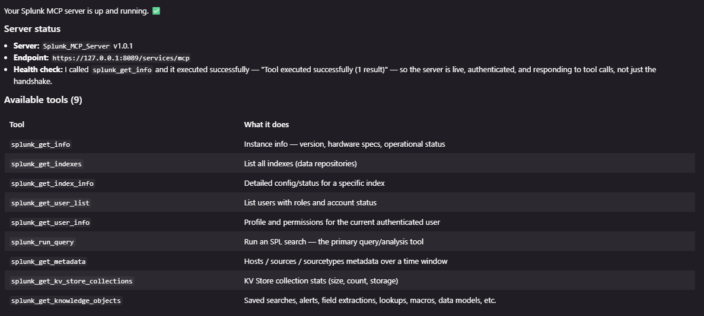

# Splunk MCP for VS Code

Minimal VS Code MCP integration for Splunk Enterprise's local MCP endpoint.
It launches `mcp-remote` through `npx`, so there is no wrapper script and
nothing to `npm install`.

## Files

- `.vscode/mcp.json` - the entire integration. Launches `npx mcp-remote`
  against the Splunk MCP endpoint and prompts for your token.
- `.gitignore` - keeps secrets and local auth cache out of git.

## Requirements

- Node.js LTS (v20+). `npx` ships with it. That is the only dependency;
  `npx` downloads and caches `mcp-remote` on first run.

## Quick Start

1. Open Splunk at `http://127.0.0.1:8000`, go to the Splunk MCP Server app,
   and create an MCP encrypted token.
2. Open this folder in VS Code.
3. Run `MCP: List Servers`, start `splunkMcp`, and paste the token when
   prompted.
4. Use Copilot Chat Agent mode and ask it to use the Splunk MCP tools.

## Connected example

A live MCP handshake against Splunk — the server is up, `splunk_get_info`
executes successfully, and all 9 tools are returned:

## Configuration notes

- Endpoint defaults to `https://127.0.0.1:8089/services/mcp`. Change the URL
  in `.vscode/mcp.json` if your Splunk listens elsewhere.
- `NODE_TLS_REJECT_UNAUTHORIZED=0` disables TLS verification. This is fine for
  a local Splunk with a self-signed certificate. Remove it (or use a trusted
  certificate) if you point this at a remote host.

## Available tools

The server exposes these tools:

- `splunk_get_info` - instance info (version, hardware, status)
- `splunk_get_indexes` - list indexes
- `splunk_get_index_info` - details for a specific index
- `splunk_get_user_list` - list users
- `splunk_get_user_info` - the current authenticated user's profile and roles
- `splunk_run_query` - run an SPL search (primary query tool)
- `splunk_get_metadata` - hosts / sources / sourcetypes metadata
- `splunk_get_kv_store_collections` - KV Store collection statistics
- `splunk_get_knowledge_objects` - saved searches, alerts, lookups, macros, data models, etc.
